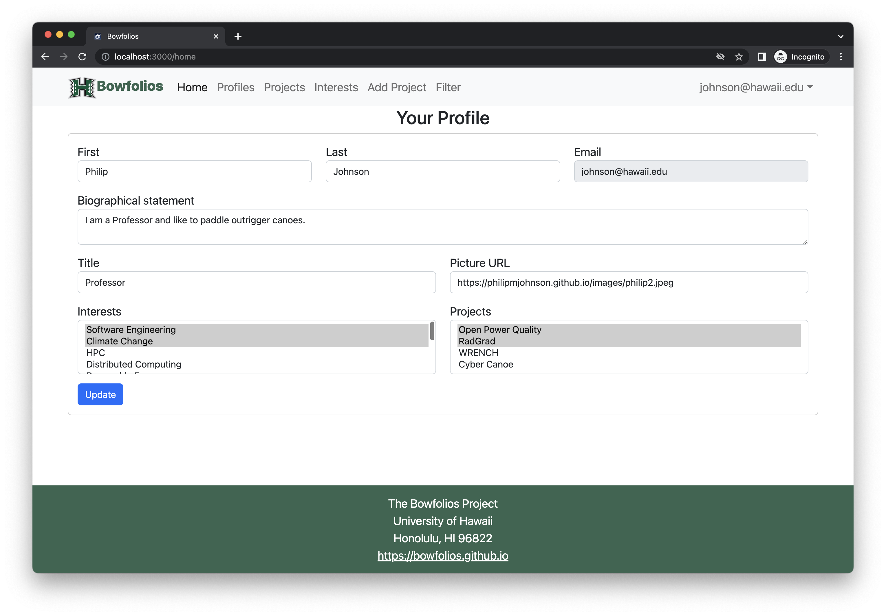
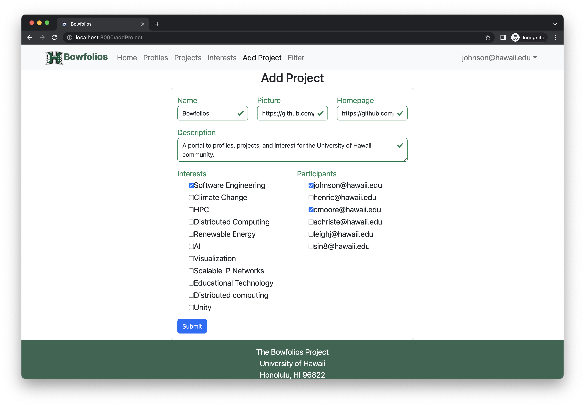
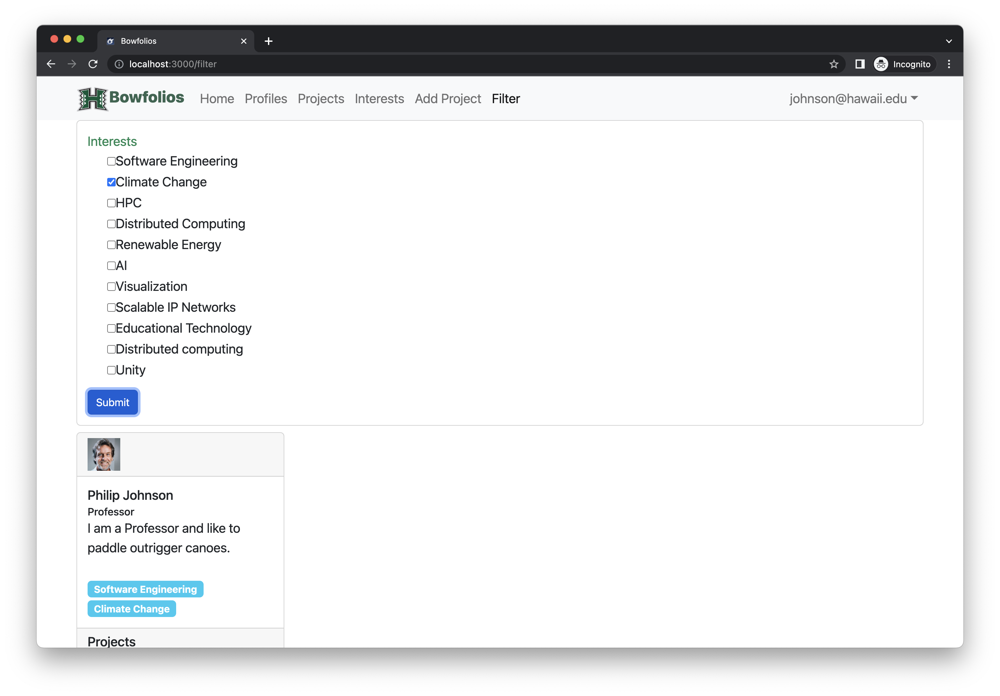

# Bowfolios

## Table of contents

* [Overview](#overview)
* [Deployment](#deployment)
* [User Guide](#user-guide)
* [Community Feedback](#community-feedback)
* [Developer Guide](#developer-guide)
* [Development History](#development-history)
* [Continuous Integration](#continuous-integration)
* [Walkthrough videos](#walkthrough-videos)
* [Example enhancements](#example-enhancements)
* [Team](#team)

## Overview

BowFolios is an example web application that provides pages to view and (in some cases) modify profiles, projects, and interests. It illustrates various technologies useful to ICS software engineering students, including:

* [Next.js](https://nextjs.org/) for Javascript-based implementation of client and server code.
* [React](https://reactjs.org/) for component-based UI implementation.
* [React Bootstrap](https://react-bootstrap.github.io/) CSS Framework for UI design.
* [Postgres](https://www.postgresql.org/) for the database.
* [Prisma](https://www.prisma.io/) as the ORM for database access and management.
* [React Hook Form](https://react-hook-form.com/) and [Zod](https://zod.dev/) for form design, display, and validation.
* [NextAuth.js](https://next-auth.js.org/) for authentication.

It also provides code that implements a variety of useful design concepts, including:

* Four primary models (User, Profile, Project, Interest) as well as three "join" tables (ProfileInterest, ProfileProject, and ProjectInterest) that implement many-to-many relationships between them.
* Top-level index pages (Profiles, Interests, and Projects) that show how to manipulate these models in various ways.
* Prisma seed code to define default Profiles, Interests, and Projects and relations between them.
* A simple Filter page to illustrate how to perform simple queries on the database and display the results.
* Use of Next.js API routes or Server Actions to illustrate how to simplify implementation of multiple model updates.
* Use of Prisma schema to enforce uniqueness of certain fields and define primary/foreign keys.
* Authentication using NextAuth.js along with Sign Up and Sign In pages.
* Authorization examples: certain pages are public (Profiles, Projects, Interests), while other pages require login (AddProject, Filter).

## User Guide

This section provides a walkthrough of the Bowfolios user interface and its capabilities.

### Landing Page

The landing page is presented to users when they visit the top-level URL to the site.


### Index pages (Projects, Profiles, Interests)

Bowfolios provides three public pages that present the contents of the database organized in various ways.

The Profiles page shows all the current defined profiles and their associated Projects and Interests:


The Projects page shows all the currently defined Projects and their associated Profiles and Interests:


Finally, the Interests page shows all the currently defined Interests, and their associated Profiles and Projects:


### Sign in and sign up

Click on the "Login" button in the upper right corner of the navbar, then select "Sign in" to go to the following page and login. You must have been previously registered with the system to use this option:


Alternatively, you can select "Sign up" to go to the following page and register as a new user:


### Home page

After logging in, you are taken to the home page, which presents a form where you can complete and/or update your personal profile:



### Add Project page

Once you are logged in, you can define new projects with the Add Project page:



### Filter page

The Filter page provides the ability to query the database and display the results in the page. In this case, the query displays all of the Profiles that match one or more of the specified Interest(s).



## Community Feedback

We are interested in your experience using Bowfolio!  If you would like, please take a couple of minutes to fill out the [Bowfolios Feedback Form](https://forms.gle/hBHdccQEbm4YNfPd6). It contains only five short questions and will help us understand how to improve the system.

## Developer Guide

This section provides information of interest to developers wishing to use this code base as a basis for their own development tasks.

### Installation

First, ensure you have [Node.js](https://nodejs.org/) installed on your system.

Second, visit the [BowfoliosNextjs application github page](https://github.com/bowfolios/bowfolios-nextjs), and click the "Use this template" button to create your own repository initialized with a copy of this application. Alternatively, you can download the sources as a zip file or make a fork of the repo. However you do it, download a copy of the repo to your local computer.

Third, cd into the `bowfolios-nextjs` directory and install libraries with:

```bash
npm install
```

Fourth, set up your environment variables. You can copy the `sample.env` file to `.env` and fill in the values:

```bash
cp sample.env .env
```

Fifth, run the database migrations and seed the database with:

```bash
npx prisma migrate dev
npm run seed
```

Finally, run the system with:

```bash
npm run dev
```

If all goes well, the application will appear at [http://localhost:3000](http://localhost:3000).

### Application Design

Bowfolios is based upon [nextjs-application-template](https://github.com/ics-software-engineering/nextjs-application-template). Please use the documentation at that site to better acquaint yourself with the basic application design and form processing in Bowfolios.

### Data model

As noted above, the Bowfolios data model consists of four primary models (User, Profiles, Projects, and Interests), as well as three "join" tables (ProfileProject, ProfileInterest, and ProjectInterest). To understand this design choice, consider the situation where you want to specify the projects associated with a Profile.

Design choice #1: Provide a field in Profile model called "Projects", and fill it with an array of project IDs. This choice works great when you want to display a Profile and indicate the Projects it's associated with. But what if you want to go the other direction: display a Project and all of the Profiles associated with it? Then you have to do a sequential search through all of the Profiles, then do a sequential search through that array field looking for a match. That's computationally expensive and also just silly.

Design choice #2: Provide a "join" table where each row contains two fields: Profile ID and Project ID. Each entry indicates that there is a relationship between those two entities. Now, to find all the Projects associated with a Profile, just search this table for all the rows that match the Profile, then extract the Project field. Going the other way is just as easy: to find all the Profiles associated with a Project, just search the table for all rows matching the Project, then extract the Profile field.

Bowfolios implements Design choice #2 using Prisma to provide pair-wise relations between its primary models:


The unique fields (Email for Profiles, and Name for Projects and Interests) indicate that those fields must have unique values so that they can be used as keys for that model. This constraint is enforced in the Prisma schema definition.

## Initialization

The `prisma/seed.js` file is used to initialize the database. It reads from a data file (typically `src/private/data.json`) and populates the database with initial Profiles, Projects, and Interests.

This file contains default definitions for Profiles, Projects, and Interests and the relationships between them.

The seeding process is triggered by running `npm run seed`.

### Quality Assurance

#### ESLint

BowFolios includes an ESLint configuration file to define the coding style adhered to in this application. You can invoke ESLint from the command line as follows:

```bash
npm run lint
```

#### End to End Testing

BowFolios uses [Playwright](https://playwright.dev/) to provide automated end-to-end testing.

To run the end-to-end tests in development mode, you should have the application running in one console window (e.g., `npm run dev`).

Then, in another console window, start up the end-to-end tests with:

```bash
npm run playwright
```

You will see browser windows appear and disappear as the tests run.

## Continuous Integration

BowFolios uses [GitHub Actions](https://docs.github.com/en/free-pro-team@latest/actions) to automatically run ESLint and Playwright each time a commit is made to the default branch. You can see the results of all recent "workflows" in the Actions tab of your repository.

## Development History

The development process for BowFolios conformed to [Issue Driven Project Management](http://courses.ics.hawaii.edu/ics314f19/modules/project-management/) practices. In a nutshell:

* Development consists of a sequence of Milestones.
* Each Milestone is specified as a set of tasks.
* Each task is described using a GitHub Issue, and is assigned to a single developer to complete.
* Tasks should typically consist of work that can be completed in 2-4 days.
* The work for each task is accomplished with a git branch named "issue-XX", where XX is replaced by the issue number.
* When a task is complete, its corresponding issue is closed and its corresponding git branch is merged into master.
* The state (todo, in progress, complete) of each task for a milestone is managed using a GitHub Project Board.

The following sections document the development history of BowFolios.

### Milestone 1: Mockup development

The goal of Milestone 1 was to create a set of HTML pages providing a mockup of the pages in the system.

Milestone 1 was managed using [BowFolio GitHub Project Board M1](https://github.com/bowfolios/bowfolios/projects/1):


### Milestone 2: Data model development

The goal of Milestone 2 was to implement the data model: the underlying set of models and the operations upon them that would support the BowFolio application.

Milestone 2 was managed using [BowFolio GitHub Project Board M2](https://github.com/bowfolios/bowfolios/projects/2):


## Milestone 3: Final touches

The goal of Milestone 3 was to clean up the code base and fix minor UI issues.

Milestone 3 was managed using [BowFolio GitHub Project Board M3](https://github.com/bowfolios/bowfolios/projects/3):


As of the time of writing, this screenshot shows that there is an ongoing task (i.e. this writing).

## Walkthrough videos

*Note: These videos were created for the older Meteor-based version of BowFolios. While the concepts remain similar, the implementation details differ significantly.*

## Example enhancements

There are a number of simple enhancements you can make to the system to become better acquainted with the codebase:

* Display an email icon that links to a mailto: for each user in the profile page.
* Display the home page for each project as a home icon. Click on it to visit the Project's home page.
* Add social media accounts to the profile (facebook, twitter, instagram) and show the associated icon in the Profile.
* The system supports the definition of users with an Admin role, but there are no Admin-specific capabilities. Implement some Admin-specific functions, such as the ability to delete users or add/modify/delete Interests.
* There is no way to edit or delete a project definition. Add this ability.
* It would be nice for users to only be able to edit the Projects that they have created. Add an "owner" field to the Project model, and then only allow a user to edit a Project definition if they own it.
* The error message associated with trying to define a new Project with an existing Project name is uninformative. Try it out for yourself to see what happens. Fix this by improving the associated API route or Server Action to "catch" errors of this type and re-throw with a more informative error message.
* The Playwright acceptance tests only test successful form submissions. Add a test in which you fill out a form incorrectly (perhaps omitting a required field) and then test to ensure that the form does not submit successfully.

## Team

BowFolios is designed, implemented, and maintained by [Philip Johnson](https://philipmjohnson.org) and [Cam Moore](https://cammoore.github.io/).
